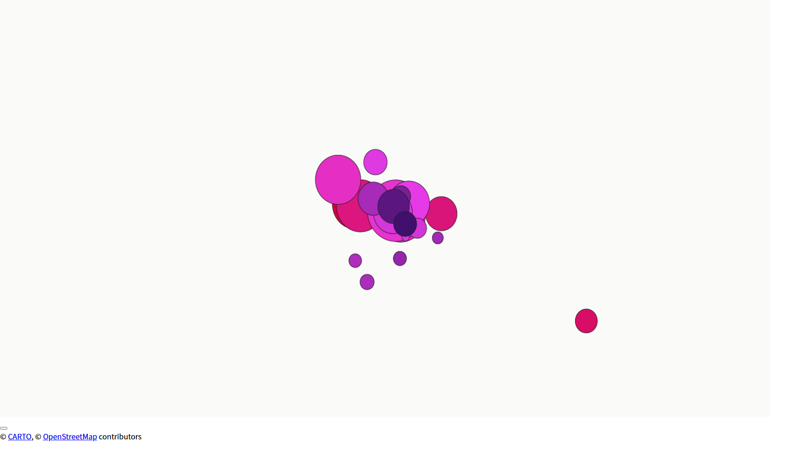

# 交互式 Dashboard —— 哈尔滨冰雪旅游服务设施供需诊断

基于 Streamlit 的单页交互应用，将结题报告的静态图表转为可交互展示，数据仅依赖已入库的 `V30` 聚合结果（**不含任何原始评论/笔记，可直接公开**）。

## 功能

| 页签 | 内容 |
|---|---|
| 总览地图 | pydeck 锚点地图（气泡大小=DHI 需求热度，颜色=SMI 错配度）+ SMI 排名条形图 + 诊断类型分布 + 一键导出（Excel / HTML / 可视化 PDF 报告） |
| 指标筛选与象限 | DHI/SSI/ERI 阈值滑块筛选 + DHI×SSI 供需象限图（对应报告图 3-18）+ 明细表 |
| 单锚点诊断 | 五指标卡片 + 小红书痛点触发率雷达图 + 大众点评餐饮压力 + 自动诊断类型与优化策略 |
| 数据质量 | 权重方案对比（等权 vs 熵权）+ IQR/Z-score 离群审计表 + 离群可视化 + 多尺度供给稳定性 |

侧边栏可切换**指标权重方案**：等权（报告基线口径）或熵权法（数据驱动客观赋权），全局指标联动更新。

**界面主题**：基于 Streamlit 原生主题（`.streamlit/config.toml`，深色冰雪大屏 / 浅色清爽双模式），右上角 **⚙ 设置 → Theme** 切换；图表配色自动跟随当前主题。

诊断分类逻辑忠实复现结题报告 3.2.6 的四类诊断信号（高需求—低供给 / 高需求—高供给—高风险 / 低需求—高风险 / 低需求—高供给），判定规则见 `dashboard_data.py::classify_anchor`。

## 渲染验证

核心地图组件（pydeck `ScatterplotLayer`，气泡大小 = DHI 需求热度、颜色 = SMI 错配度）渲染截图：



> 注：该截图由 headless Chromium 对 pydeck 静态渲染生成，用于验证地图组件；完整 Streamlit 页面请本地运行查看。

## 本地运行

```powershell
pip install -r requirements.txt
cd 05_streamlit_dashboard
streamlit run app.py
```

## 部署到 Streamlit Cloud（免费）

1. 将本仓库推送到 GitHub（`git remote add origin <你的仓库地址> && git push -u origin main`）。
2. 登录 <https://share.streamlit.io> → New app → 选择仓库。
3. 配置：
   - **Main file path**: `05_streamlit_dashboard/app.py`
   - **Python version**: 3.11+（仓库默认即可）
4. Deploy。依赖由 `requirements.txt` 自动安装（含 streamlit/plotly/pydeck/openpyxl）。

> **已部署过的应用**：工程化改造（新增「数据质量」页签、权重切换、一键导出）后，在应用页面的 **Deploy 菜单 → Rebuild**（或重新推送触发自动 rebuild）即可更新，无需重新创建 app。

> 注意：仓库根目录即 Streamlit 的工作目录，`dashboard_data.py` 通过脚本相对位置推导数据路径，clone 后无需任何配置。

## 数据与口径边界

- 数据源：`02_多源融合数据及核心脚本/V30_Multi_Source_Fusion_R2/*.csv`（20 锚点聚合统计），指标由 `src/engines/metrics_engine.py` 计算。
- 所有指标为 20 锚点样本内 Z-score 相对值（0 = 样本均值），`DHI/SSI/ERI > 0` 表示高于样本平均水平。
- 权重方案：等权与报告口径逐值一致；熵权法按样本离散度客观赋权（常数列权重为 0）。
- 痛点触发率 = 该类痛点提及次数 / 该锚点总提及次数，用于避免高热度地点天然放大风险。
- 离群检测：右偏数量列（设施数量/评论量）经 log1p 变换后再做 IQR/Z-score，避免低端漏检。
- 分类阈值取 0 为界，是报告"相对比较"口径的直接复现，不表示绝对水平。
